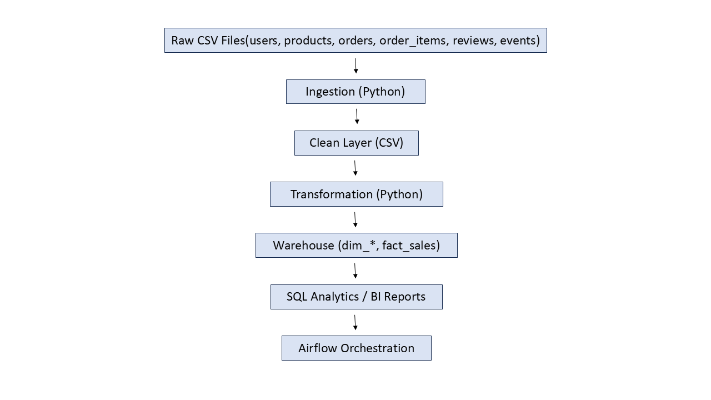

# Retail Data Pipeline (E-Commerce Dataset)

*A complete end-to-end data engineering portfolio project.*

This project demonstrates a real-world data pipeline built on a synthetic e-commerce dataset containing users, products, orders, order_items, reviews, and event logs. It covers ingestion, cleaning, transformation, warehouse modeling, data quality testing, analytics, and orchestration with Airflow.

---

## 🚀 Architecture



---

## 📂 Project Structure

```text
retail-data-pipeline/
├── data/
│   ├── raw/                 # original CSV files
│   ├── clean/               # cleaned ingestion outputs
│   └── warehouse/           # dim_* and fact_* tables
│
├── src/
│   ├── ingest/              # ingestion code
│   ├── transform/           # transformation code
│   └── load/                # (optional) loading scripts
│
├── dags/                    # Airflow DAGs
├── sql/                     # SQL schema + business queries
├── tests/                   # pytest data quality tests
├── docs/                    # architecture diagrams, notes
└── README.md
```

## 🧱 Pipeline Stages

### 1️⃣ Ingestion

**File:** `src/ingest/ingest_data.py`

Reads 6 raw CSV files from `data/raw`:

- users.csv
- products.csv
- orders.csv
- order_items.csv
- reviews.csv
- events.csv

- Removes completely empty rows  
- Saves cleaned versions to `data/clean/` (prefixed with `clean_`)

---

### 2️⃣ Transformation

**File:** `src/transform/transform_data.py`

Loads cleaned data from `data/clean/`

Builds warehouse tables:

- dim_users  
- dim_products  
- fact_sales (joins orders + order_items)

Additional processing:

- Normalizes `order_status` values  
- Computes `line_amount`  
- Saves warehouse tables to `data/warehouse/`

---

### 3️⃣ Data Warehouse

**Location:** `data/warehouse/`

Contains:

- dim_users.csv  
- dim_products.csv  
- fact_sales.csv  

---

### 4️⃣ Data Quality Testing

**Files:**

- `tests/test_transformations.py`  
- `tests/test_data_quality.py`

Tests include:

- No null `user_id` or `product_id`  
- No negative or zero quantities  
- Correct `line_amount` calculations  
- Valid gender values  
- Non-negative product prices  
- Only allowed `order_status` values  

Run tests:

```bash
pytest
```

---

### 5️⃣ SQL Analytics

Folder: `sql/`

Includes:

- `create_tables.sql` – warehouse schema documentation
- `business_metrics.sql` – example business queries

Queries cover:

- Revenue by category
- Top-selling products
- Daily revenue trends
- Customer lifetime value
- Order status distribution

---

### 6️⃣ Orchestration with Airflow

File: `dags/retail_pipeline_dag.py`

A daily Airflow DAG that runs:

Ingest → Transform → Warehouse

Uses `PythonOperator` to call pipeline scripts.

---

## 🛠 Tech Stack

- Python (Pandas)
- SQL
- Pytest
- Apache Airflow (DAG authoring)
- Git & GitHub
- VS Code
- Powerpoint (architecture diagram)

---

##▶️ How to Run This Project Locally

###1. Clone repository

```bash
git clone https://github.com/DeepthiPalle381/retail-data-pipeline.git
cd retail-data-pipeline

```

###2. Create virtual environment

```bash
python -m venv .venv
.venv\Scripts\activate
pip install -r requirements.txt

```

###3. Run ingestion

```bash
python src/ingest/ingest_data.py

```

###4. Run transformation

```bash
python src/transform/transform_data.py

```

###5. Run tests

```bash
pytest


